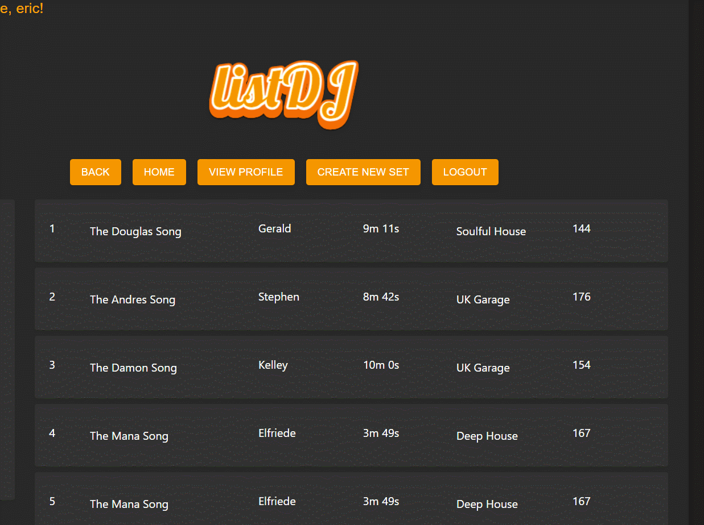

# listDJ

## Description

This application is designed to host DJ mixes/setlists so that DJs can share them with their peers and to also keep track 
of their own. The users have the ability to make new setlists, edit them and also can view other user's setlists as well.

[Sample Website](https://listdj-app.onrender.com)

## General Usage

1. On their first visit, users will be greeted by a Login page. Users will have the ability to create a new account.

2. Once logged in, the user will be greeted by a homepage with a navigation bar on the top.

3. The homepage displays a list of all the latest mixes created by users. The user can use the search bar to search by setlist name, DJ name or by genre name.

4. Clicking on any of the setlists will bring the user to the setlist page. The setlist page offers a short description card
as well as the tracklist of songs used to make the set. 

5. Clicking on 'View DJ Profile' in the description card will allow you to view the DJ's profile.

6. The Profile page will display their biography as well as their user avatar. 

7. The user may delete their entire account by scrolling to the bottom. This will also delete all asociated setlists made by the user.

## Creating Your Own Set

1. Users can create their own set by clicking on "CREATE NEW SET" on the navigation bar.

2. For the setlist, users must fill out the name, description, approximate length (in minutes), and genre using the leftmost card. 

3. For the tracks, the user must fill out the name, artist, length, BPM (beats per minute) and genre using the rightmost card. Once
complete, the user can click on "ADD TRACK" to add the track to the setlist. Repeat this step for every track in the setlist.

4. Track information can be edited once it has been added using the '✏️' icon. Once track information has been edited, you can 
save the changes with the '💾' icon. Note that you will not be allowed to edit anything else until the '💾' icon has been pressed again.

5. Using the Up and Down arrow buttons will allow you to change track order.

6. Using the '🗑️' icon will allow you to delete a track.

6. Once everything has been added, the user can click on "SUBMIT" to create the new setlist. 

7. The user will be taken to their profile page where they can view the set they have just created.

## Editing Your Own Set

1. Once users have made their setlists, users can view their sets by clicking "VIEW PROFILE" in the navigation bar.

2. Once a user clicks on a set, they can change the name, description and approximate length of the setlist by clicking "EDIT" on the leftmost card.

3. Scrolling to the bottom of the page, the user can hit "EDIT" to edit the setlist itself.

4. Track information can be edited using the '✏️' icon. Once track information has been edited, you can save the changes with the '💾' icon. Note that you will not be allowed to edit anything else until the '💾' icon has been pressed again.

5. Using the Up and Down arrow buttons will allow you to change track order.

6. Using the '🗑️' icon will allow you to delete a track.

7. For adding new tracks, the user must fill out the name, artist, length, BPM (beats per minute) and genre using the bottom most card. Once complete, the user can click on "ADD TRACK" to add the track to the setlist. Repeat this step for every track that needs to be added.

8. Once all the changes have been made, the user can hit "SAVE" to save the edited setlist. If they did not like the changes they made, the user can also hit "CANCEL" to undo all changes.

9. If the user choose to, they may also use "DELETE SET" to delete the entire setlist.

## Examples:

General Usage:

General Usage 2:

Creating New Setlist:

Creating New Setlist 2:

Editing Setlist:

Editing Setlist 2:
 

## Project Status

9/5/23 - Completed version 0.1

## Planned Features

1. Ability keep track of all tracks used previously

2. Ability to comment on setlists

3. Ability to post links to completed setlists.

## Credits  

- [Open ClipArt](https://openclipart.org) for default seed images

## Author

This application is by Eric Song who is currently studying the Flex program at Flatiron School.

[Github](https://github.com/ericksong91)

[Linkedin](https://www.linkedin.com/in/eric-song-45597062)

## Contributing 
Pull requests are welcome. For major changes, please open an issue first to discuss what you would like to change.

Please make sure to update tests as appropriate.

## License
[MIT](https://choosealicense.com/licenses/mit/)